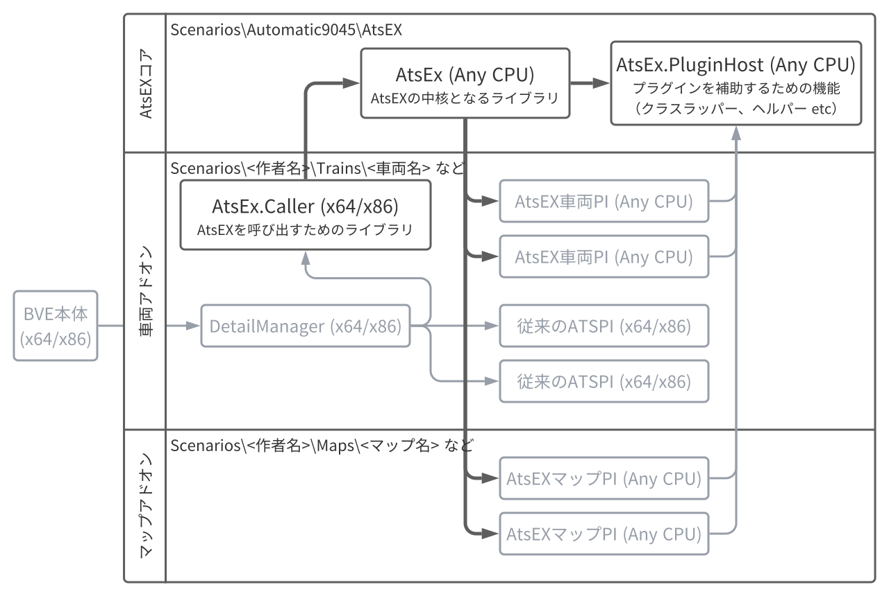

# AtsEX
【BVE5・6向け】ATSプラグインの機能を拡張するプラグインです。

詳細は→https://automatic9045.github.io/contents/bve/AtsEX/

## 名前の由来
**ATS**プラグインを拡張（**ex**tend）するプラグイン

## ライセンス
[The MIT License](LICENSE)

## リリースのダウンロード

[こちら](https://github.com/automatic9045/AtsEX/releases)

## リポジトリのセットアップ手順

**※AtsEX自体のソースコードを編集するための手順です。AtsEXを利用してプラグインを開発する場合はこちらではなく[リリース](https://github.com/automatic9045/AtsEX/releases)を参照してください。**

### 1. リポジトリをクローンする

もちろんご自身のGitHubアカウントでフォークしてからクローンされても構いません。

### 2. ローカルで参照しているアセンブリを配置する

以下のアセンブリはNuGetを介さずに参照しているため、手動での配置が必要です。

#### Mackoy.IInputDevice.DLL (Mackoy氏)

BVE本体（`BveTs.exe`）と同じフォルダ内にある`Mackoy.IInputDevice.DLL`を`AtsEx.PluginHost\LocalReferences\BveTs`内にコピーしてください。

#### Mackoy.XmlInterfaces.DLL (Mackoy氏)

BVE本体（`BveTs.exe`）と同じフォルダ内にある`Mackoy.XmlInterfaces.DLL`を`AtsEx.PluginHost\LocalReferences\BveTs`内にコピーしてください。

#### Zbx1425.DXDynamicTexture-net48.dll・Zbx1425.DXDynamicTexture-net35.dll (zbx1425氏)

[GitHubのリリースページ](https://github.com/zbx1425/DXDynamicTexture/releases)からダウンロードし、`AtsEx.PluginHost\LocalReferences\DXDynamicTexture`内にコピーしてください。

### 3. （既にソリューションをVisual Studioで開いている場合は）Visual Studioを再起動する

### 4. NuGet経由で参照しているアセンブリをダウンロードする

一度ビルドすると自動でダウンロードされます。

## プロジェクトの構成

## 使用ライブラリ等（アルファベット順）
#### [.NET Runtime](https://github.com/dotnet/runtime) (MIT)

Copyright (c) .NET Foundation and Contributors

`System.Collection.Generic.SortedList<Tkey, TValue>` のソースを一部流用しています。

#### [DllExport](https://github.com/3F/DllExport) (MIT)

Copyright (c) 2009-2015  Robert Giesecke  
Copyright (c) 2016-2021  Denis Kuzmin <x-3F@outlook.com> github/3F

#### [DXDynamicTexture](https://github.com/zbx1425/DXDynamicTexture) (MIT)

Copyright (c) 2021 zbx1425

#### [Harmony](https://github.com/pardeike/Harmony) (MIT)

Copyright (c) 2017  Andreas Pardeike

#### [SlimDX](https://www.nuget.org/packages/SlimDX/) (MIT)

Copyright (c) 2013  exDreamDuck

#### [Octokit](https://github.com/octokit/octokit.net) (MIT)

Copyright 2017 GitHub, Inc.

### サンプルシナリオにのみ含まれるもの

#### [KeyboardFont_Plus](http://www.gaiji.info/) (CC BY-ND 3.0)

フォント by 外字神社 is licensed under a [Creative Commons 表示 - 改変禁止 3.0 Unported License.](http://creativecommons.org/licenses/by-nd/3.0/)

www.gaiji.info にある作品に基づいている。
